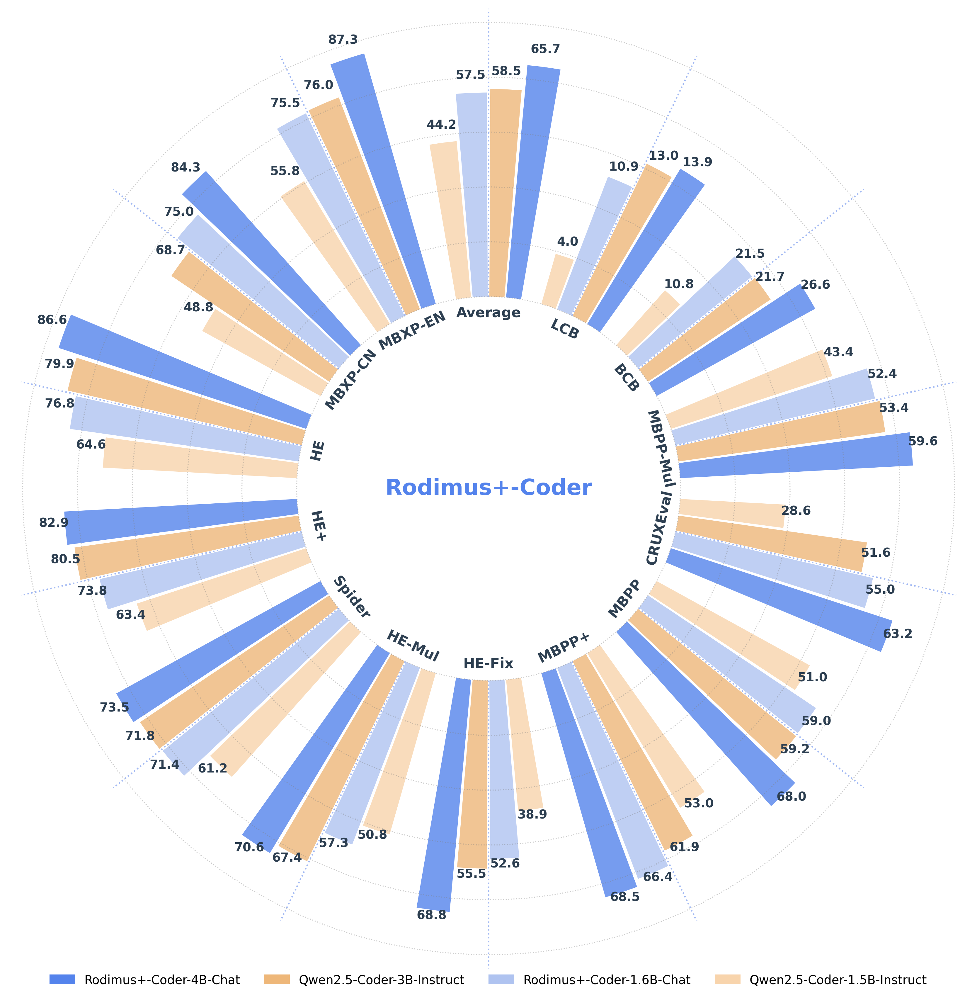

<div align=center>

</div>

<h2 align="center"> <a href="https://openreview.net/forum?id=IIVYiJ1ggK">Rodimus&ast;: Breaking the Accuracy-Efficiency Trade-Off with Efficient Attentions
</a></h2>
<h5 align="center"> If you like our project, please give us a star ⭐ on GitHub for the latest update.</h5>

<h5 align=center>

<!-- [](https://huggingface.co/spaces/Chat-UniVi/Chat-UniVi) -->
[](https://huggingface.co/)
[](https://modelscope.cn)
[](https://openreview.net/forum?id=IIVYiJ1ggK)
[](https://choosealicense.com/licenses/apache-2.0/)
</h5>

## Overview

We propose Rodimus&ast;, including Rodimus and Rodimus+, which tries to break the accuracy-efficency trade-off existing in Vanilla tranformers by introducing several innovative features. 

**Rodimus:**
* Linear attention-based, purely recurrent model.
* Incorporates Data-Dependent Tempered Selection (DDTS) for semantic compression.
* Reduced memory usage.

**Rodimus+:**
* Hybrid model combining Rodimus with Sliding Window Shared-Key Attention (SW-SKA).
* Enhances semantic, token, and head compression.

<div align=center>
 
</div>

**Rodimus+-Coder:**
* We train and open-source the lightweight Rodimus+-Coder model, available in 1.6B and 4B sizes, achieving performance surpassing SOTA models of similar sizes.

<div align=center>
 
</div>

## Highlights

* **Constant memory footprint but better language modeling performance.**
<div align=center>
 
</div>

* **Better scaling performance than Transformer.**
<div align=center>
 
</div>

* **A real lite model, without memory complexity O(T) in KV cache.**

## Pretrained Checkpoints

### Benchmark Checkpoints

> This checkpoints completed training before submitting the paper, used to reproduce the benchmarks in the paper. 
> 
> If you want to use the more practical model, we strongly recommand you to download the checkpionts in **Rodimus+-Coder**.

<div align="center">

|     **Model (2024/10/01)**      | **#Total Params** | **Training Tokens** | **Context Length** | **Download** |
| :----------------: | :---------------: | :----------------: | :----------: | :----------: |
| Rodimus-1.4B-Base |       1.4B       |       500B       |        2K         |      [🤗 HuggingFace](https://huggingface.co/codefuse-admin/rodimus_1B4_base_20241001) <br> [🤖 ModelScope](https://www.modelscope.cn/models/codefuse-ai/rodimus_1B4_base_20241001) |
| Rodimus+-1.6B-Base |       1.6B       |       1T       |        2K         |      [🤗 HuggingFace](https://huggingface.co/codefuse-ai/rodimus_plus_1B6_base_20241001) <br> [🤖 ModelScope](https://www.modelscope.cn/models/codefuse-ai/rodimus_plus_1B6_base_20241001) |
| Rodimus+-Coder-1.6B-Base-20241001 |       1.6B       |       2.5T       |        4K         |      [🤗 HuggingFace](https://huggingface.co/codefuse-ai/rodimus_plus_coder_1B6_base_20241001) <br> [🤖 ModelScope](https://www.modelscope.cn/models/codefuse-ai/rodimus_plus_coder_1B6_base_20241001) |

</div>

The `Rodimus+-Coder-1.6B-Base-20241001` is the model enhanced by multi-stage training with math and code datasets in the paper.

### Rodimus+-Coder Checkpoints

You can download the following table to see the various parameters for your use case. If you are located in mainland China, we also provide the model on modelscope.cn to speed up the download process.

<div align="center">

|     **Model**      | **#Total Params** | **Training Tokens** | **Context Length** | **Download** |
| :----------------: | :---------------: | :----------------: | :----------------: | :----------: |
| Rodimus+-Coder-1.6B-Base |       1.6B       |       8.2T       |        4K         |      [🤗 HuggingFace](https://huggingface.co/codefuse-ai/Rodimus-Plus-Coder-1.6B-Base) <br> [🤖 ModelScope](https://modelscope.cn/models/codefuse-ai/Rodimus-Plus-Coder-1.6B-Base) |
| Rodimus+-Coder-1.6B-Chat |       1.6B       |       -       |        4K         |      [🤗 HuggingFace](https://huggingface.co/codefuse-ai/Rodimus-Plus-Coder-1.6B-Chat) <br> [🤖 ModelScope](https://modelscope.cn/models/codefuse-ai/Rodimus-Plus-Coder-1.6B-Chat) |
| Rodimus+-Coder-4B-Base |       4B       |       8.2T       |        4K         |      [🤗 HuggingFace](https://huggingface.co/codefuse-ai/Rodimus-Plus-Coder-4B-Base) <br> [🤖 ModelScope](https://modelscope.cn/models/codefuse-ai/Rodimus-Plus-Coder-4B-Base) |
| Rodimus+-Coder-4B-Chat |       4B       |       -       |        4K         |      [🤗 HuggingFace](https://huggingface.co/codefuse-ai/Rodimus-Plus-Coder-4B-Chat) <br> [🤖 ModelScope](https://modelscope.cn/models/codefuse-ai/Rodimus-Plus-Coder-4B-Chat) |

</div>

## Rodimus+-Coder Evaluation

We re-evaluate the metrics of the Qwen series models, and the metrics of other series models are quoted from the original paper. For detailed evaluation code, please refer to the evaluation method of Ling-Coder-Lite in [CodeFuse-Evaluation](https://github.com/codefuse-ai/codefuse-evaluation).

### Rodimus+-Coder-Base

<table>
    <tr align="center">
        <th>Datasets</th>
        <th>Qwen2.5-Coder-1.5B</th>
        <th>Rodimus+-Coder-1.6B-Base</th>
        <th>Gemma2-2B-PT</th>
        <th>Qwen2.5-Coder-3B</th>
        <th>Rodimus+-Coder-4B-Base</th>
        <th>Gemma3-4B-PT</th>
        <th>Qwen2.5-Coder-7B</th>
    </tr>
    <tr align="center">
        <td colspan="8">Coding Tasks</td>
    </tr>
    <tr align="center">
        <td>HumanEval</td>
        <td>41.5</td>
        <td>51.2</td>
        <td>19.5</td>
        <td>51.8</td>
        <th>60.4</th>
        <td>36.0</td>
        <th>60.4</th>
    </tr>
    <tr align="center">
        <td>HumanEval+</td>
        <td>34.8</td>
        <td>45.1</td>
        <td>-</td>
        <td>40.9</td>
        <th>52.4</th>
        <td>-</td>
        <td>50.6</td>
    </tr>
    <tr align="center">
        <td>MBPP</td>
        <td>57.2</td>
        <td>51.2</td>
        <td>31.0</td>
        <td>62.6</td>
        <td>64.6</td>
        <td>46.0</td>
        <th>70.0</th>
    </tr>
    <tr align="center">
        <td>MBPP+</td>
        <td>66.1</td>
        <td>62.2</td>
        <td>-</td>
        <td>65.9</td>
        <th>71.4</th>
        <td>-</td>
        <td>70.1</td>
    </tr>
    <tr align="center">
        <td>BCB<sub>COMPLETION</sub></td>
        <td>21.6</td>
        <td>17.9</td>
        <td>-</td>
        <td>26.2</td>
        <th>30.8</th>
        <td>-</td>
        <td>30.4</td>
    </tr>
    <tr align="center">
        <td>MultiPL-E</td>
        <td>46.1</td>
        <td>52.5</td>
        <td>-</td>
        <td>49.4</td>
        <th>60.7</th>
        <td>-</td>
        <td>56.9</td>
    </tr>
    <tr align="center">
        <td>CRUXEval</td>
        <td>38.5</td>
        <td>45.1</td>
        <td>-</td>
        <td>44.6</td>
        <td>56.4</td>
        <td>-</td>
        <th>56.8</th>
    </tr>
    <tr align="center">
        <th>Coding Avg.</th>
        <td>43.7</td>
        <td>46.5</td>
        <td>-</td>
        <td>48.8</td>
        <th>56.7</th>
        <td>-</td>
        <td>56.4</td>
    </tr>
    <tr align="center">
        <td colspan="8">General Tasks</td>
    </tr>
    <tr align="center">
        <td>C-EVAL</td>
        <td>55.2</td>
        <td>56.7</td>
        <td>-</td>
        <td>65.3</td>
        <th>70.2</th>
        <td>-</td>
        <td>69.1</td>
    </tr>
    <tr align="center">
        <td>CMMLU</td>
        <td>54.5</td>
        <td>52.3</td>
        <td>-</td>
        <td>65.4</td>
        <td>68.3</td>
        <td>-</td>
        <th>72.7</th>
    </tr>
    <tr align="center">
        <td>MMLU</td>
        <td>55.5</td>
        <td>51.1</td>
        <td>52.2</td>
        <td>63.3</td>
        <td>62.6</td>
        <td>59.6</td>
        <th>70.5</th>
    </tr>
    <tr align="center">
        <td>BBH</td>
        <td>21.8</td>
        <td>46.8</td>
        <td>42.4</td>
        <td>32.5</td>
        <td>61.9</td>
        <td>50.9</td>
        <th>67.3</th>
    </tr>
    <tr align="center">
        <th>General Avg.</th>
        <td>46.8</td>
        <td>51.7</td>
        <td>-</td>
        <td>56.6</td>
        <td>65.8</td>
        <td>-</td>
        <td>69.9</td>
    </tr>
    <tr align="center">
        <td colspan="8">Mathematics Tasks</td>
    </tr>
    <tr align="center">
        <td>GSM8K</td>
        <td>60.4</td>
        <td>68.7</td>
        <td>25.0</td>
        <td>72.1</td>
        <td>78.5</td>
        <td>38.4</td>
        <td>83.4</td>
    </tr>
    <tr align="center">
        <td>MATH</td>
        <td>23.7</td>
        <td>29.0</td>
        <td>16.4</td>
        <td>31.9</td>
        <td>37.0</td>
        <td>24.2</td>
        <td>42.2</td>
    </tr>
    <tr align="center">
        <th>Math Avg.</th>
        <td>41.9</td>
        <td>48.9</td>
        <td>20.7</td>
        <td>52.0</td>
        <td>57.8</td>
        <td>31.3</td>
        <td>62.8</td>
    </tr>
    <tr align="center">
        <td colspan="8">Overall</td>
    </tr>
    <tr align="center">
        <th>Overall</th>
        <td>44.4</td>
        <td>48.4</td>
        <td>-</td>
        <td>51.7</td>
        <th>59.6</th>
        <td>-</td>
        <th>61.6</th>
    </tr>
</table>

### Rodimus+-Coder-Chat

<table>
    <tr align="center">
        <th>Datasets</th>
        <th>Qwen2.5-Coder-1.5B-Instruct</th>
        <th>Rodimus+-Coder-1.6B-Chat</th>
        <th>Gemma2-2B-IT</th>
        <th>Qwen2.5-Coder-Instruct</th>
        <th>Phi-4-Mini-3.8B</th>
        <th>Rodimus+-Coder-4B-Chat</th>
        <th>Gemma3-4B-IT</th>
        <th>Qwen2.5-Coder-7B-Instruct</th>
    </tr>
    <tr align="center">
        <td colspan="9">Coding Tasks</td>
    </tr>
    <tr align="center">
        <td>HumanEval</td>
        <td>64.6</td>
        <td>76.8</td>
        <td>20.1</td>
        <td>79.9</td>
        <td>74.4</td>
        <td>86.6</td>
        <td>71.3</td>
        <td>87.2</td>
    </tr>
    <tr align="center">
        <td>HumanEval+</td>
        <td>63.4</td>
        <td>73.8</td>
        <td>-</td>
        <td>80.5</td>
        <td>68.3</td>
        <td>82.9</td>
        <td>-</td>
        <td>82.3</td>
    </tr>
    <tr align="center">
        <td>MBPP</td>
        <td>51.0</td>
        <td>59.0</td>
        <td>36.6</td>
        <td>59.2</td>
        <td>65.3</td>
        <td>68.0</td>
        <td>63.2</td>
        <td>75.8</td>
    </tr>
    <tr align="center">
        <td>MBPP+</td>
        <td>53.0</td>
        <td>66.4</td>
        <td>-</td>
        <td>61.9</td>
        <td>63.8</td>
        <td>68.5</td>
        <td>-</td>
        <td>75.1</td>
    </tr>
    <tr align="center">
        <td>LCB<sub>(24.08-24.11)</sub></td>
        <td>4.0</td>
        <td>10.9</td>
        <td>-</td>
        <td>13.0</td>
        <td>-</td>
        <td>13.9</td>
        <td>-</td>
        <td>22.8</td>
    </tr>
    <tr align="center">
        <td>BCB<sub>INSTRUCT</sub></td>
        <td>10.8</td>
        <td>21.5</td>
        <td>-</td>
        <td>21.7</td>
        <td>33.8</td>
        <td>26.6</td>
        <td>-</td>
        <td>30.6</td>
    </tr>
    <tr align="center">
        <td>HumanEval-Mul</td>
        <td>50.8</td>
        <td>57.3</td>
        <td>-</td>
        <td>67.4</td>
        <td>-</td>
        <td>70.6</td>
        <td>-</td>
        <td>76.1</td>
    </tr>
    <tr align="center">
        <td>MBPP-Mul</td>
        <td>43.4</td>
        <td>52.4</td>
        <td>-</td>
        <td>53.4</td>
        <td>-</td>
        <td>59.6</td>
        <td>-</td>
        <td>61.4</td>
    </tr>
    <tr align="center">
        <td>MBXP-EN</td>
        <td>55.8</td>
        <td>75.5</td>
        <td>-</td>
        <td>76.0</td>
        <td>-</td>
        <td>87.3</td>
        <td>-</td>
        <td>87.7</td>
    </tr>
    <tr align="center">
        <td>MBXP-CN</td>
        <td>48.8</td>
        <td>75.0</td>
        <td>-</td>
        <td>68.7</td>
        <td>-</td>
        <td>84.3</td>
        <td>-</td>
        <td>83.5</td>
    </tr>
    <tr align="center">
        <td>CRUXEval</td>
        <td>28.6</td>
        <td>55.0</td>
        <td>-</td>
        <td>51.6</td>
        <td>-</td>
        <td>63.2</td>
        <td>-</td>
        <td>69.3</td>
    </tr>
    <tr align="center">
        <td>HumanEvalFix</td>
        <td>38.9</td>
        <td>52.6</td>
        <td>-</td>
        <td>55.5</td>
        <td>-</td>
        <td>68.8</td>
        <td>-</td>
        <td>69.3</td>
    </tr>
    <tr align="center">
        <td>Spider</td>
        <td>61.2</td>
        <td>71.4</td>
        <td>-</td>
        <td>71.8</td>
        <td>42.2</td>
        <td>73.5</td>
        <td>-</td>
        <td>82.0</td>
    </tr>
    <tr align="center">
        <th>Coding Avg.</th>
        <td>44.2</td>
        <td>57.5</td>
        <td>-</td>
        <td>58.5</td>
        <td>-</td>
        <th>65.7</th>
        <td>-</td>
        <th>69.5</th>
    </tr>
    <tr align="center">
        <td colspan="9">General Tasks</td>
    </tr>
    <tr align="center">
        <td>C-EVAL</td>
        <td>51.5</td>
        <td>50.8</td>
        <td>-</td>
        <td>62.0</td>
        <td>-</td>
        <td>61.6</td>
        <td>-</td>
        <td>66.4</td>
    </tr>
    <tr align="center">
        <td>CMMLU</td>
        <td>45.2</td>
        <td>50.5</td>
        <td>-</td>
        <td>60.1</td>
        <td>-</td>
        <td>62.0</td>
        <td>-</td>
        <td>64.9</td>
    </tr>
    <tr align="center">
        <td>MMLU</td>
        <td>52.0</td>
        <td>49.3</td>
        <td>56.1</td>
        <td>61.7</td>
        <td>67.3</td>
        <td>57.5</td>
        <td>58.1</td>
        <td>66.1</td>
    </tr>
    <tr align="center">
        <td>BBH</td>
        <td>24.2</td>
        <td>58.7</td>
        <td>41.4</td>
        <td>57.3</td>
        <td>70.4</td>
        <td>63.7</td>
        <td>72.2</td>
        <td>59.1</td>
    </tr>
    <tr align="center">
        <th>General Avg.</th>
        <td>43.2</td>
        <td>52.3</td>
        <td>-</td>
        <td>60.3</td>
        <td>-</td>
        <td>61.2</td>
        <td>-</td>
        <td>64.1</td>
    </tr>
    <tr align="center">
        <td colspan="9">Mathematics Tasks</td>
    </tr>
    <tr align="center">
        <td>GSM8K</td>
        <td>54.4</td>
        <td>68.5</td>
        <td>62.6</td>
        <td>73.5</td>
        <td>88.6</td>
        <td>79.2</td>
        <td>89.2</td>
        <td>79.5</td>
    </tr>
    <tr align="center">
        <td>MATH</td>
        <td>38.1</td>
        <td>33.5</td>
        <td>27.2</td>
        <td>44.1</td>
        <td>64.0</td>
        <td>44.1</td>
        <td>75.6</td>
        <td>60.8</td>
    </tr>
    <tr align="center">
        <th>Math Avg.</th>
        <td>46.2</td>
        <td>51.0</td>
        <td>44.9</td>
        <td>58.8</td>
        <td>68.8</td>
        <td>61.7</td>
        <td>82.4</td>
        <td>70.1</td>
    </tr>
    <tr align="center">
        <td colspan="9">Overall</td>
    </tr>
    <tr align="center">
        <th>Overall</th>
        <td>44.2</td>
        <td>55.8</td>
        <td>-</td>
        <td>58.9</td>
        <td>-</td>
        <th>64.3</th>
        <td>-</td>
        <th>68.4</th>
    </tr>
</table>

## Quick Starts

### Installation

1. The latest version of <a href="https://github.com/huggingface/transformers">`transformers`</a> is recommended (at least 4.42.0). 
2. We evaluate our models with `python=3.8` and `torch==2.1.2`.
3. If you use Rodimus, you need to install <a href="https://github.com/sustcsonglin/flash-linear-attention">`flash-linear-attention`</a>, <a href="https://github.com/Dao-AILab/causal-conv1d">`causal_conv1d`</a> and <a href="https://github.com/triton-lang/triton">`triton>=2.2.0`</a>. If you use Rodimus+, you need to further install <a href="https://github.com/Dao-AILab/flash-attention">`flash-attention`</a>. 

### Examples

 In `examples/generation_script.py`, we show a code snippet to show you how to use the model to generate:

```python
import os
import torch
from modeling_rodimus import RodimusForCausalLM
from tokenization_rodimus_fast import RodimusTokenizer

# load model
ckpt_dir = "model_path"
tokenizer = RodimusTokenizer.from_pretrained(ckpt_dir)
model = RodimusForCausalLM.from_pretrained(
    ckpt_dir,
    torch_dtype=torch.float16,
    device_map="cuda"
).eval()

# inference
input_prompt = "你好！你是谁？"
model_inputs = tokenizer(input_prompt, return_tensors="pt").to(model.device)
outputs = model.generate(**model_inputs, max_length=32)
response = tokenizer.batch_decode(outputs, skip_special_tokens=True)[0]

print(response)
```

In `examples/chat_script.py`, we further show how to chat with Rodimus+:

```python
import os
import torch
from modeling_rodimus import RodimusForCausalLM
from tokenization_rodimus_fast import RodimusTokenizer

# load model
ckpt_dir = "model_path"
tokenizer = RodimusTokenizer.from_pretrained(ckpt_dir)
model = RodimusForCausalLM.from_pretrained(
    ckpt_dir,
    torch_dtype=torch.float16,
    device_map="cuda"
).eval()

# inference
input_prompt = "简单介绍一下大型语言模型。"
messages = [
    {"role": "HUMAN", "content": input_prompt}
]

text = tokenizer.apply_chat_template(
    messages,
    system='You are Rodimus$+$, created by AntGroup. You are a helpful assistant.',
    tokenize=False,
)
print(text)
model_inputs = tokenizer(text, return_tensors="pt").to(model.device)
outputs = model.generate(**model_inputs, max_length=2048)
response = tokenizer.batch_decode(outputs, skip_special_tokens=True)[0]

print(response)
```

## Citation

If you find our work helpful, feel free to give us a cite.

```
@inproceedings{
    he2025rodimus,
    title={Rodimus*: Breaking the Accuracy-Efficiency Trade-Off with Efficient Attentions},
    author={Zhihao He and Hang Yu and Zi Gong and Shizhan Liu and Jianguo Li and Weiyao Lin},
    booktitle={The Thirteenth International Conference on Learning Representations},
    year={2025},
    url={https://openreview.net/forum?id=IIVYiJ1ggK}
}
```
